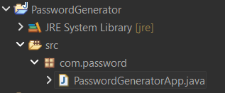
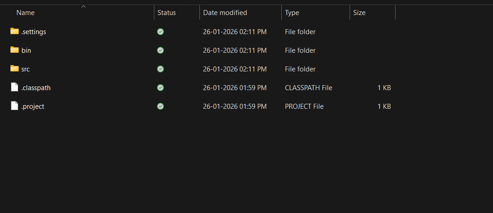
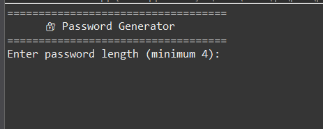

# 🔐 Password Generator (Java Console Project)

A short and impressive **Java Password Generator** that creates strong random passwords based on user input length.  
This project uses core Java concepts like `Random`, `StringBuilder`, and loops to generate secure passwords.

---

## 🚀 Features

✅ User can enter password length  
✅ Generates strong passwords using:
- Uppercase letters (A-Z)
- Lowercase letters (a-z)
- Numbers (0-9)
- Special characters (!@#$%^&*)

✅ Fast and simple console-based application  
✅ Beginner-friendly & recruiter-friendly project

---

## 🧠 Concepts Used

- `Random` class
- `StringBuilder`
- Loops (`for`)
- `Scanner` for user input
- String handling & logic building

---

## 🛠️ Tech Stack

- **Language:** Java   
- **Application Type:** Console Based  

---

## 📂 Project Structure

PasswordGenerator/
│
├── src/
│ └── com/password/
│ └── PasswordGeneratorApp.java
│
├── screenshots/
│ ├── console_output.png
│ ├── program_structure.png
│ └── run_program.png
│
└── README.md


---

## 🖥️ Sample Output

===================================

🔐 Password Generator
Enter password length (minimum 4): 10

✅ Generated Strong Password: A1@kXz8#Lm


---

## 📸 Screenshots

### ✅ Program Structure


### ✅ Run Program


### ✅ Console Output


---
## ▶️ How to Run

### ✅ 1) Clone the Repository
```bash
git clone https://github.com/mkmishra2503/java_password_generator.git

```

---
⭐ If you like this project, please give it a **star** ⭐
